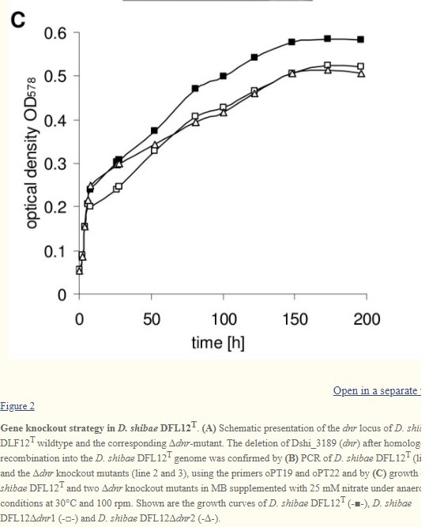

Homework 6
================

1.  This graph shows the variation in growth of two bacterial species,
    CB-A and CB-D. This is a line graph showing a standard growth curve.
2.  This plot is trying to relay the growth patterns of two bacterial
    species, and showing that they differ.
3.  This plot is successful because it succeeds in what it tries to do.
    It tells us what species are being viewed, shows us how they grow
    over time, and allows us to see that they differ. I have not
    included the figure legend, because it is not needed to understand
    what is trying to be shown.
4.  I cannot think of anything to add to this plot. It is simple and
    straightforward. It gets the idea across while not adding too much.

Plot acquired from: Basso, J.T.R., Ankrah, N.Y.D., Tuttle, M.J. et al. 
Genetically similar temperate phages form coalitions with their shared
host that lead to niche-specific fitness effects. ISME J 14, 1688–1700
(2020). <https://doi.org/10.1038/s41396-020-0637-z>

1.  This plot is showing growth dynamics of a marine bacteria with two
    gene knockouts of the same species.
2.  The plot is trying to show that the bacteria have altered growth
    dynamics based on genes being knocked out. 3.This plot has two
    primary issues. Firstly, I see that there are three different test
    groups, but I don’t know what they mean. The figure legend is in the
    figure description, not on the graph itself. As a viewer, it is
    annoying to see that. You now have to go and read a figure legend,
    when the graph should be self explanatory. Along with that, there is
    plenty of white space to include a figure legend in the plot itself,
    suggesting either the graph creator did not know how, or was too
    lazy to add one.

Secondly, the graph has no error bars. We do not know if these were
representative of what normally happens, or if it is a bizarre outlier.
Even in the figure legends, no mention of statistical performance is
indicated.

4.  Adding in error bars and a figure legend would make the graph near
    perfect. It doesn’t have to be complicated. Simple and self
    explanatory, in my eyes, is fantastic. Don’t tell someone what you
    want to show in a graph in the graph’s description, make the graph
    to where it can stand alone without a description.

Plot acquired from: Piekarski, T., Buchholz, I., Drepper, T., Schobert,
M., Wagner-Doebler, I., Tielen, P., & Jahn, D. (2009). Genetic tools for
the investigation of Roseobacter clade bacteria. BMC microbiology, 9,
265. <https://doi.org/10.1186/1471-2180-9-265>
