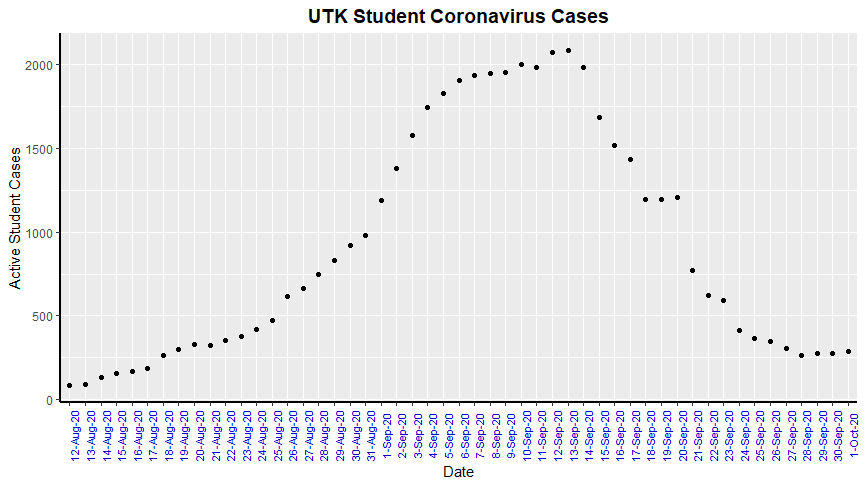

The first objective for generating this "bad plot" is installing the appropriate
packages, which is only necessary if they are not already downloaded. This can
be done by running the commands: 

install.packages("tidyverse")                                                   
install.packages("png")                                                         
install.packages("ggpubr")

These have been left out of a script file, so as to avoid accidental unwanted
downloading. After installing the appropriate packages, they need to be 
initialized so that the scripts will run as needed. Initialization is done via 
the commands below.

```{r eval = FALSE}
library(tidyverse)
library(png)
library(ggplot)
library(ggpubr)
```

"png" and "ggpubr" allow for the integration of image files as objects and 
integration of images into ggplot, respectively. After initializing the 
required packages, objects need to be created. They store UTK Covid-19 data and
an image file as objects respectively.

```{r}
UTK_Covid_Data <- read_csv("data/UTK_Covid_data.csv")
space_cat_img <- readPNG("homework/hw_07/data/spacecat.png")
```

The following r script will be broken up so as they are easily described. The 
initial portion of the script is to inform R what data to utilize. The first of
the next four lines informs the program to utilize the object "UTK_Covid_Data"'s
Students and Date data as the x and y axis, respectively. The second and third 
lines are commands which give the plot a title and subtitle, while the fourth
line integrates the previously stored object, "space_cat_img", as the plot's
background.

```{r eval = FALSE}
badplot_step_1 <- ggplot(UTK_Covid_Data, aes(x = Students, y = Date))+
  ggtitle(label= "how bad we slippin",
          subtitle= "sheer summation o' slippin students")+
  background_image(space_cat_img)
print(badplot_step_1)
```


After generating the first portion of our bad plot, we can then edit some of 
the details to make it as bad possible. We first change the background to a
green background that takes away from are slide, as well as the next two lines
which adjust the size, location, and color of the already horrible title and 
subtitle.


```{r eval = FALSE}
badplot_step_2 <- badplot_step_1 +theme(
    plot.background = element_rect(fill="green"),
    plot.title = element_text(color ="red", size = 24, face= "bold.italic", 
        hjust=1),
    plot.subtitle = element_text(color = "purple", size= 18, face= "bold"))
print(badplot_step_2)
```


Next, we want to completely confuse the viewer by getting rid of the logical
"Date" and "Students" categories utilized for the x and y axes. To disrupt the
x axis even further, we add a vague "name", or title, to our axis, listing 
breaks which serve as label locations at the points equivalent to 30, 200, 700,
1100, 1645, and 2100 active student cases. This ensures maximum confusion by
using a combination of incomprehensible terms and irregular label locations to 
imply a non-regular scale. We then specify the labels at each location ranking
in terms of how far the individuals are "slippin" on  a scale of "standin" to 
"oof".

```{r eval = FALSE}
badplot_step_3 <- badplot_step_2 + 
  scale_x_continuous(name = "slip severity of slippin slippers", 
        breaks=c(30, 200, 700, 1100, 1645, 2100), labels = c("30"= "standin", 
        "200" = "slippin", "700" = "trippin", "1100" = "frickin flippin", 
        "1645"= "bruh were in a pandemic", "2100" = "oof"))
print(badplot_step_3)
```


You'll notice that the x-axis title changed, but not the labels. Do not fret,
they will appear once we specify the data to be used. Next we want to do the 
same with the y-axis. First we label y-axis title as done previously, but as
the data is discrete opposed to continuous like the x-axis, the command is 
slightly varied. To make the y-axis labels as confusing as the x-axis ones, we
also explicitly label each date with a random celebrity instead, with the chosen
individuals birthday coinciding with the specific date.

```{r eval = FALSE}
badplot_step_4 <- badplot_step_3 + 
  scale_y_discrete(name = "who a slippin slipper", labels =c("12-Aug-20" = 
        "George Soros","13-Aug-20" = "Danny Bonaduce","14-Aug-20" = 
        "Halle Berry", "15-Aug-20" = "Ben Affleck","16-Aug-20" = "Madonna",
        "17-Aug-20" = "Robert De Niro","18-Aug-20" = "Patrick Swayze",
        "19-Aug-20" = "Peter Gallagher","20-Aug-20" = "Demi Lovato", "21-Aug-20"
        = "Hayden Pannettiere", "22-Aug-20" = "Dua Lipa", "23-Aug-20" = 
        "Louis XVI","24-Aug-20" = "Dave Chappelle","25-Aug-20" = "Sean Connery",
        "26-Aug-20" = "Keke Palmer", "27-Aug-20" = "Sarah Chalke","28-Aug-20" = 
        "Jack Black","29-Aug-20" = "Michael Jackson","30-Aug-20" = 
        "Cameron Diaz","31-Aug-20" = "Chris Tucker","1-Sep-20" = "Dr. Phil", 
        "2-Sep-20" = "Keanu Reeves","3-Sep-20" = "Charlie Sheen","4-Sep-20" = 
        "Beyonce","5-Sep-20" = "Michael Keaton","6-Sep-20" = "Idris Elba", 
        "7-Sep-20" = "Elizabeth I", "8-Sep-20" = "Pink", "9-Sep-20" = 
        "Adam Sandler", "10-Sep-20" = "Guy Ritchie", "11-Sep-20" = "Kygo", 
        "12-Sep-20" = "Paul Walker", "13-Sep-20" = "Tyler Perry", "14-Sep-20" = 
        "Andrew Lincoln", "15-Sep-20" = "Tommy Lee Jones", "16-Sep-20" = 
        "B.B. King", "17-Sep-20" = "Narendra Modi", "18-Sep-20" = 
        "Lance Armstrong", "19-Sep-20" = "Jimmy Fallon", "20-Sep-20" = 
        "George R. R. Martin", "21-Sep-20" = "Stephen King", "22-Sep-20" = 
        "Andrea Bocelli","23-Sep-20" = "Bruce Springsteen", "24-Sep-20" = 
        "F. Scott Fitzgerald", "25-Sep-20" = "Will Smith", "26-Sep-20" = 
        "Serena Williams", "27-Sep-20" = "Lil Wayne", "28-Sep-20" = 
        "Naomi Watts", "29-Sep-20" = "Kevin Durant", "30-Sep-20" = "T-Pain",
        "1-Oct-20" = "Zach Galifianakis"))+
```


The rest of the above command is listed below. This additional theme command
allows for the adjustment of axis labels to increase incoordination by altering
both shape and color, and for the y-axis flipping the labels upside down.
Additionally, we add a worthless cyan "dotdash" edge around our graph, as well
as adjusting axis title color and size.

```{r eval = FALSE}
  theme(
    axis.text.y = element_text(face = "plain", color = "#FF69B4", size = 8, angle = 180), 
    axis.text.x = element_text(face = "bold", color = "#FF0000", size = 8),
    axis.line = element_line(colour = "#00FFFF", size = 4, linetype = "dotdash", lineend = "round"),
    axis.title.x = element_text(color = "purple", size = 22, face = "bold"),
    axis.title.y = element_text(color = "#B19CD9", size = 30, face = "bold.italic"))+
  geom_dotplot(aes(x = Students))
print(badplot_step_4)
```

Together the above commands look as follows and form our finished, wonderful 
product. Note that the data points have appeared in the form of a dot plot,
where impossible to interpret black circles appear at the bottom of the plot
area.


```{r eval = FALSE}
badplot_step_4 <- badplot_step_3 + 
  scale_y_discrete(name = "who a slippin slipper", labels =c("12-Aug-20" = 
        "George Soros","13-Aug-20" = "Danny Bonaduce","14-Aug-20" = 
        "Halle Berry", "15-Aug-20" = "Ben Affleck","16-Aug-20" = "Madonna",
        "17-Aug-20" = "Robert De Niro","18-Aug-20" = "Patrick Swayze",
        "19-Aug-20" = "Peter Gallagher","20-Aug-20" = "Demi Lovato", "21-Aug-20"
        = "Hayden Pannettiere", "22-Aug-20" = "Dua Lipa", "23-Aug-20" = 
        "Louis XVI","24-Aug-20" = "Dave Chappelle","25-Aug-20" = "Sean Connery",
        "26-Aug-20" = "Keke Palmer", "27-Aug-20" = "Sarah Chalke","28-Aug-20" = 
        "Jack Black","29-Aug-20" = "Michael Jackson","30-Aug-20" = 
        "Cameron Diaz","31-Aug-20" = "Chris Tucker","1-Sep-20" = "Dr. Phil", 
        "2-Sep-20" = "Keanu Reeves","3-Sep-20" = "Charlie Sheen","4-Sep-20" = 
        "Beyonce","5-Sep-20" = "Michael Keaton","6-Sep-20" = "Idris Elba", 
        "7-Sep-20" = "Elizabeth I", "8-Sep-20" = "Pink", "9-Sep-20" = 
        "Adam Sandler", "10-Sep-20" = "Guy Ritchie", "11-Sep-20" = "Kygo", 
        "12-Sep-20" = "Paul Walker", "13-Sep-20" = "Tyler Perry", "14-Sep-20" = 
        "Andrew Lincoln", "15-Sep-20" = "Tommy Lee Jones", "16-Sep-20" = 
        "B.B. King", "17-Sep-20" = "Narendra Modi", "18-Sep-20" = 
        "Lance Armstrong", "19-Sep-20" = "Jimmy Fallon", "20-Sep-20" = 
        "George R. R. Martin", "21-Sep-20" = "Stephen King", "22-Sep-20" = 
        "Andrea Bocelli","23-Sep-20" = "Bruce Springsteen", "24-Sep-20" = 
        "F. Scott Fitzgerald", "25-Sep-20" = "Will Smith", "26-Sep-20" = 
        "Serena Williams", "27-Sep-20" = "Lil Wayne", "28-Sep-20" = 
        "Naomi Watts", "29-Sep-20" = "Kevin Durant", "30-Sep-20" = "T-Pain",
        "1-Oct-20" = "Zach Galifianakis"))+
   theme(
    axis.text.y = element_text(face = "plain", color = "#FF69B4", size = 8, angle = 180), 
    axis.text.x = element_text(face = "bold", color = "#FF0000", size = 8),
    axis.line = element_line(colour = "#00FFFF", size = 4, linetype = "dotdash", lineend = "round"),
    axis.title.x = element_text(color = "purple", size = 22, face = "bold"),
    axis.title.y = element_text(color = "#B19CD9", size = 30, face = "bold.italic"))+
  geom_dotplot(aes(x = Students))
print(badplot_step_4)
```

The entire graph can also be formulated by the script below.

```{r eval = FALSE}
library(tidyverse)
library(png)
library(ggpubr)

UTK_Covid_Data <- read_csv("data/UTK_Covid_data.csv")
space_cat_img <- readPNG("homework/hw_07/spacecat.png")

ggplot(UTK_Covid_Data, aes(x = Students, y = Date))+
  ggtitle(label= "how bad we slippin",
          subtitle= "sheer summation o' slippin students")+
  background_image(space_cat_img)+
  theme(
    plot.background = element_rect(fill="green"),
    plot.title = element_text(color ="red", size = 24, face= "bold.italic", 
        hjust=1),
    plot.subtitle = element_text(color = "purple", size= 18, face= "bold"))+
  scale_x_continuous(name = "slip severity of slippin slippers", 
        breaks=c(30, 200, 700, 1100, 1645, 2100), labels = c("30"= "standin", 
        "200" = "slippin", "700" = "trippin", "1100" = "frickin flippin", 
        "1645"= "bruh were in a pandemic", "2100" = "oof"))+
  scale_y_discrete(name = "who a slippin slipper", labels =c("12-Aug-20" = 
        "George Soros","13-Aug-20" = "Danny Bonaduce","14-Aug-20" = 
        "Halle Berry", "15-Aug-20" = "Ben Affleck","16-Aug-20" = "Madonna",
        "17-Aug-20" = "Robert De Niro","18-Aug-20" = "Patrick Swayze",
        "19-Aug-20" = "Peter Gallagher","20-Aug-20" = "Demi Lovato", "21-Aug-20"
        = "Hayden Pannettiere", "22-Aug-20" = "Dua Lipa", "23-Aug-20" = 
        "Louis XVI","24-Aug-20" = "Dave Chappelle","25-Aug-20" = "Sean Connery",
        "26-Aug-20" = "Keke Palmer", "27-Aug-20" = "Sarah Chalke","28-Aug-20" = 
        "Jack Black","29-Aug-20" = "Michael Jackson","30-Aug-20" = 
        "Cameron Diaz","31-Aug-20" = "Chris Tucker","1-Sep-20" = "Dr. Phil", 
        "2-Sep-20" = "Keanu Reeves","3-Sep-20" = "Charlie Sheen","4-Sep-20" = 
        "Beyonce","5-Sep-20" = "Michael Keaton","6-Sep-20" = "Idris Elba", 
        "7-Sep-20" = "Elizabeth I", "8-Sep-20" = "Pink", "9-Sep-20" = 
        "Adam Sandler", "10-Sep-20" = "Guy Ritchie", "11-Sep-20" = "Kygo", 
        "12-Sep-20" = "Paul Walker", "13-Sep-20" = "Tyler Perry", "14-Sep-20" = 
        "Andrew Lincoln", "15-Sep-20" = "Tommy Lee Jones", "16-Sep-20" = 
        "B.B. King", "17-Sep-20" = "Narendra Modi", "18-Sep-20" = 
        "Lance Armstrong", "19-Sep-20" = "Jimmy Fallon", "20-Sep-20" = 
        "George R. R. Martin", "21-Sep-20" = "Stephen King", "22-Sep-20" = 
        "Andrea Bocelli","23-Sep-20" = "Bruce Springsteen", "24-Sep-20" = 
        "F. Scott Fitzgerald", "25-Sep-20" = "Will Smith", "26-Sep-20" = 
        "Serena Williams", "27-Sep-20" = "Lil Wayne", "28-Sep-20" = 
        "Naomi Watts", "29-Sep-20" = "Kevin Durant", "30-Sep-20" = "T-Pain",
        "1-Oct-20" = "Zach Galifianakis"))+
   theme(
    axis.text.y = element_text(face = "plain", color = "#FF69B4", size = 8, angle = 180), 
    axis.text.x = element_text(face = "bold", color = "#FF0000", size = 8),
    axis.line = element_line(colour = "#00FFFF", size = 4, linetype = "dotdash", lineend = "round"),
    axis.title.x = element_text(color = "purple", size = 22, face = "bold"),
    axis.title.y = element_text(color = "#B19CD9", size = 40, face = "bold.italic"))+
  geom_dotplot(aes(x = Students))
```


The good plot was created by the code below. The commands tell ggplot to utilize
the object "UTK_Covid_Data" like in the Bad Plot, but differs by locating the
date on the x-axis and the "Students" column on the y-axis. The date column is
first changed to a blue color and formatted so the size and angle allow for
all dates to appear on the graph without conflicting with one another. The plot
title is also formatted so its size is adjusted, words bolded, and centered in 
the plot. The "scale_x_discrete" command is utilized to readjust the "Dates" 
data, as by default they organize themselves numerically. This is problematic as 
it starts with "1-Oct-20" followed by "1-Sep-20" and "10-Sep-20", so on and so 
on. This step puts them in chronological order which allows for proper viewing 
of the graphic. Next, the y-axis title is altered to state "Active Student 
Cases" as this is what the "Students" column actually denotes. And lastly, an 
axis line is added to cleanly edge out the x and y axes.

```{r eval = FALSE}
ggplot(UTK_Covid_Data, aes(x = Date, y = Students))+
  ggtitle("UTK Student Coronavirus Cases") +
  theme(axis.text.x=element_text(face="plain", color = "#0000CD", size=8, angle=90), 
        plot.title = element_text(color ="black", size = 14, face= "bold", hjust=0.5))+
  scale_x_discrete(name = "Date",
          limits=c("12-Aug-20","13-Aug-20","14-Aug-20","15-Aug-20","16-Aug-20",
                  "17-Aug-20","18-Aug-20","19-Aug-20","20-Aug-20","21-Aug-20",
                  "22-Aug-20","23-Aug-20","24-Aug-20","25-Aug-20","26-Aug-20",
                  "27-Aug-20","28-Aug-20","29-Aug-20","30-Aug-20","31-Aug-20",
                  "1-Sep-20","2-Sep-20","3-Sep-20","4-Sep-20","5-Sep-20",
                  "6-Sep-20","7-Sep-20","8-Sep-20","9-Sep-20","10-Sep-20",
                  "11-Sep-20","12-Sep-20","13-Sep-20","14-Sep-20","15-Sep-20",
                  "16-Sep-20","17-Sep-20","18-Sep-20","19-Sep-20","20-Sep-20",
                  "21-Sep-20","22-Sep-20","23-Sep-20","24-Sep-20","25-Sep-20",
                  "26-Sep-20","27-Sep-20","28-Sep-20","29-Sep-20","30-Sep-20",
                  "1-Oct-20")) +
  scale_y_continuous(name="Active Student Cases")+
  theme(axis.line = element_line(colour="black", size = 1, linetype= "solid")) +
  geom_point()
```

