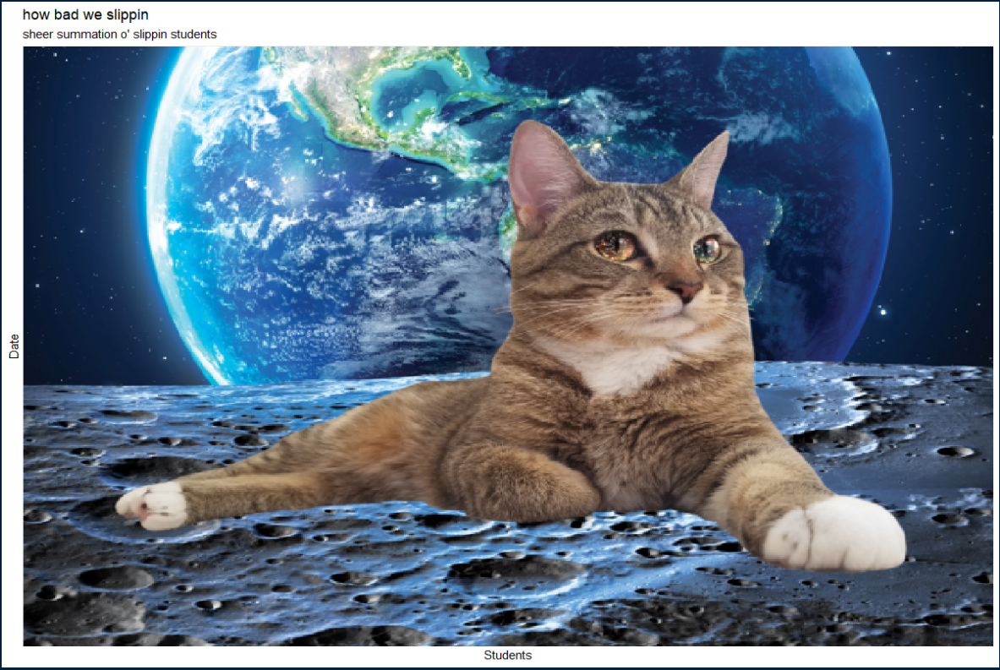
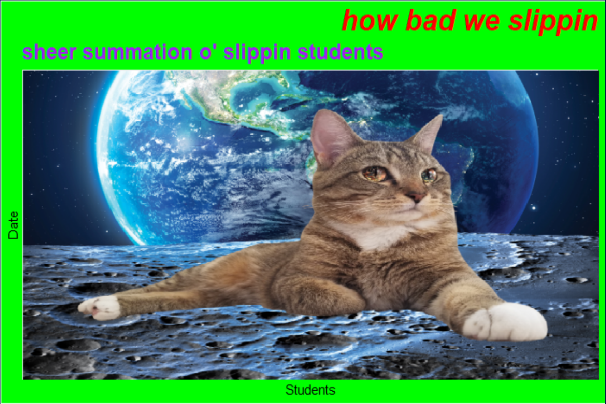

Bad Plot Competition
================

The first objective for generating this “bad plot” is installing the
appropriate packages, which is only necessary if they are not already
downloaded. This can be done by running the commands:

install.packages(“tidyverse”)  
install.packages(“png”)  
install.packages(“ggpubr”)

These have been left out of a script file, so as to avoid accidental
unwanted downloading. After installing the appropriate packages, they
need to be initialized so that the scripts will run as needed.
Initialization is done via the commands below.

``` r
library(tidyverse)
library(png)
library(ggplot)
library(ggpubr)
```

“png” and “ggpubr” allow for the integration of image files as objects
and integration of images into ggplot, respectively. After initializing
the required packages, objects need to be created. They store UTK
Covid-19 data and an image file as objects respectively.

``` r
UTK_Covid_Data <- read_csv("data/UTK_Covid_data.csv")
space_cat_img <- readPNG("homework/hw_07/data/spacecat.png")
```

The following r script will be broken up so as they are easily
described. The initial portion of the script is to inform R what data to
utilize. The first of the next four lines informs the program to utilize
the object “UTK\_Covid\_Data”’s Students and Date data as the x and y
axis, respectively. The second and third lines are commands which give
the plot a title and subtitle, while the fourth line integrates the
previously stored object, “space\_cat\_img”, as the plot’s background.

``` r
badplot_step_1 <- ggplot(UTK_Covid_Data, aes(x = Students, y = Date))+
  ggtitle(label= "how bad we slippin",
          subtitle= "sheer summation o' slippin students")+
  background_image(space_cat_img)
print(badplot_step_1)
```



After generating the first portion of our bad plot, we can then edit
some of the details to make it as bad possible. We first change the
background to a green background that takes away from are slide, as well
as the next two lines which adjust the size, location, and color of the
already horrible title and subtitle.

``` r
badplot_step_2 <- badplot_step_1 +theme(
    plot.background = element_rect(fill="green"),
    plot.title = element_text(color ="red", size = 24, face= "bold.italic", 
        hjust=1),
    plot.subtitle = element_text(color = "purple", size= 18, face= "bold"))
print(badplot_step_2)
```



Next, we want to completely confuse the viewer by getting rid of the
logical “Date” and “Students” categories utilized for the x and y axes.
To disrupt the x axis even further, we add a vague “name”, or title, to
our axis, listing breaks which serve as label locations at the points
equivalent to 30, 200, 700, 1100, 1645, and 2100 active student cases.
This ensures maximum confusion by using a combination of
incomprehensible terms and irregular label locations to imply a
non-regular scale. We then specify the labels at each location ranking
in terms of how far the individuals are “slippin” on a scale of
“standin” to “oof”.

``` r
badplot_step_3 <- badplot_step_2 + 
  scale_x_continuous(name = "slip severity of slippin slippers", 
        breaks=c(30, 200, 700, 1100, 1645, 2100), labels = c("30"= "standin", 
        "200" = "slippin", "700" = "trippin", "1100" = "frickin flippin", 
        "1645"= "bruh were in a pandemic", "2100" = "oof"))
print(badplot_step_3)
```


You’ll notice that the x-axis title changed, but not the labels. Do not
fret, they will appear once we specify the data to be used. Next we want
to do the same with the y-axis. First we label y-axis title as done
previously, but as the data is discrete opposed to continuous like the
x-axis, the command is slightly varied. To make the y-axis labels as
confusing as the x-axis ones, we also explicitly label each date with a
random celebrity instead, with the chosen individuals birthday
coinciding with the specific date.

``` r
badplot_step_4 <- badplot_step_3 + 
  scale_y_discrete(name = "who a slippin slipper", labels =c("12-Aug-20" = 
        "George Soros","13-Aug-20" = "Danny Bonaduce","14-Aug-20" = 
        "Halle Berry", "15-Aug-20" = "Ben Affleck","16-Aug-20" = "Madonna",
        "17-Aug-20" = "Robert De Niro","18-Aug-20" = "Patrick Swayze",
        "19-Aug-20" = "Peter Gallagher","20-Aug-20" = "Demi Lovato", "21-Aug-20"
        = "Hayden Pannettiere", "22-Aug-20" = "Dua Lipa", "23-Aug-20" = 
        "Louis XVI","24-Aug-20" = "Dave Chappelle","25-Aug-20" = "Sean Connery",
        "26-Aug-20" = "Keke Palmer", "27-Aug-20" = "Sarah Chalke","28-Aug-20" = 
        "Jack Black","29-Aug-20" = "Michael Jackson","30-Aug-20" = 
        "Cameron Diaz","31-Aug-20" = "Chris Tucker","1-Sep-20" = "Dr. Phil", 
        "2-Sep-20" = "Keanu Reeves","3-Sep-20" = "Charlie Sheen","4-Sep-20" = 
        "Beyonce","5-Sep-20" = "Michael Keaton","6-Sep-20" = "Idris Elba", 
        "7-Sep-20" = "Elizabeth I", "8-Sep-20" = "Pink", "9-Sep-20" = 
        "Adam Sandler", "10-Sep-20" = "Guy Ritchie", "11-Sep-20" = "Kygo", 
        "12-Sep-20" = "Paul Walker", "13-Sep-20" = "Tyler Perry", "14-Sep-20" = 
        "Andrew Lincoln", "15-Sep-20" = "Tommy Lee Jones", "16-Sep-20" = 
        "B.B. King", "17-Sep-20" = "Narendra Modi", "18-Sep-20" = 
        "Lance Armstrong", "19-Sep-20" = "Jimmy Fallon", "20-Sep-20" = 
        "George R. R. Martin", "21-Sep-20" = "Stephen King", "22-Sep-20" = 
        "Andrea Bocelli","23-Sep-20" = "Bruce Springsteen", "24-Sep-20" = 
        "F. Scott Fitzgerald", "25-Sep-20" = "Will Smith", "26-Sep-20" = 
        "Serena Williams", "27-Sep-20" = "Lil Wayne", "28-Sep-20" = 
        "Naomi Watts", "29-Sep-20" = "Kevin Durant", "30-Sep-20" = "T-Pain",
        "1-Oct-20" = "Zach Galifianakis"))+
```

The rest of the above command is listed below. This additional theme
command allows for the adjustment of axis labels to increase
incoordination by altering both shape and color, and for the y-axis
flipping the labels upside down. Additionally, we add a worthless cyan
“dotdash” edge around our graph, as well as adjusting axis title color
and size.

``` r
  theme(
    axis.text.y = element_text(face = "plain", color = "#FF69B4", size = 8, angle = 180), 
    axis.text.x = element_text(face = "bold", color = "#FF0000", size = 8),
    axis.line = element_line(colour = "#00FFFF", size = 4, linetype = "dotdash", lineend = "round"),
    axis.title.x = element_text(color = "purple", size = 22, face = "bold"),
    axis.title.y = element_text(color = "#B19CD9", size = 30, face = "bold.italic"))+
  geom_dotplot(aes(x = Students))
print(badplot_step_4)
```

Together the above commands look as follows and form our finished,
wonderful product. Note that the data points have appeared in the form
of a dot plot, where impossible to interpret black circles appear at the
bottom of the plot area.


``` r
badplot_step_4 <- badplot_step_3 + 
  scale_y_discrete(name = "who a slippin slipper", labels =c("12-Aug-20" = 
        "George Soros","13-Aug-20" = "Danny Bonaduce","14-Aug-20" = 
        "Halle Berry", "15-Aug-20" = "Ben Affleck","16-Aug-20" = "Madonna",
        "17-Aug-20" = "Robert De Niro","18-Aug-20" = "Patrick Swayze",
        "19-Aug-20" = "Peter Gallagher","20-Aug-20" = "Demi Lovato", "21-Aug-20"
        = "Hayden Pannettiere", "22-Aug-20" = "Dua Lipa", "23-Aug-20" = 
        "Louis XVI","24-Aug-20" = "Dave Chappelle","25-Aug-20" = "Sean Connery",
        "26-Aug-20" = "Keke Palmer", "27-Aug-20" = "Sarah Chalke","28-Aug-20" = 
        "Jack Black","29-Aug-20" = "Michael Jackson","30-Aug-20" = 
        "Cameron Diaz","31-Aug-20" = "Chris Tucker","1-Sep-20" = "Dr. Phil", 
        "2-Sep-20" = "Keanu Reeves","3-Sep-20" = "Charlie Sheen","4-Sep-20" = 
        "Beyonce","5-Sep-20" = "Michael Keaton","6-Sep-20" = "Idris Elba", 
        "7-Sep-20" = "Elizabeth I", "8-Sep-20" = "Pink", "9-Sep-20" = 
        "Adam Sandler", "10-Sep-20" = "Guy Ritchie", "11-Sep-20" = "Kygo", 
        "12-Sep-20" = "Paul Walker", "13-Sep-20" = "Tyler Perry", "14-Sep-20" = 
        "Andrew Lincoln", "15-Sep-20" = "Tommy Lee Jones", "16-Sep-20" = 
        "B.B. King", "17-Sep-20" = "Narendra Modi", "18-Sep-20" = 
        "Lance Armstrong", "19-Sep-20" = "Jimmy Fallon", "20-Sep-20" = 
        "George R. R. Martin", "21-Sep-20" = "Stephen King", "22-Sep-20" = 
        "Andrea Bocelli","23-Sep-20" = "Bruce Springsteen", "24-Sep-20" = 
        "F. Scott Fitzgerald", "25-Sep-20" = "Will Smith", "26-Sep-20" = 
        "Serena Williams", "27-Sep-20" = "Lil Wayne", "28-Sep-20" = 
        "Naomi Watts", "29-Sep-20" = "Kevin Durant", "30-Sep-20" = "T-Pain",
        "1-Oct-20" = "Zach Galifianakis"))+
   theme(
    axis.text.y = element_text(face = "plain", color = "#FF69B4", size = 8, angle = 180), 
    axis.text.x = element_text(face = "bold", color = "#FF0000", size = 8),
    axis.line = element_line(colour = "#00FFFF", size = 4, linetype = "dotdash", lineend = "round"),
    axis.title.x = element_text(color = "purple", size = 22, face = "bold"),
    axis.title.y = element_text(color = "#B19CD9", size = 30, face = "bold.italic"))+
  geom_dotplot(aes(x = Students))
print(badplot_step_4)
```

The entire graph can also be formulated by the script below.

``` r
library(tidyverse)
library(png)
library(ggpubr)

UTK_Covid_Data <- read_csv("data/UTK_Covid_data.csv")
space_cat_img <- readPNG("homework/hw_07/spacecat.png")

ggplot(UTK_Covid_Data, aes(x = Students, y = Date))+
  ggtitle(label= "how bad we slippin",
          subtitle= "sheer summation o' slippin students")+
  background_image(space_cat_img)+
  theme(
    plot.background = element_rect(fill="green"),
    plot.title = element_text(color ="red", size = 24, face= "bold.italic", 
        hjust=1),
    plot.subtitle = element_text(color = "purple", size= 18, face= "bold"))+
  scale_x_continuous(name = "slip severity of slippin slippers", 
        breaks=c(30, 200, 700, 1100, 1645, 2100), labels = c("30"= "standin", 
        "200" = "slippin", "700" = "trippin", "1100" = "frickin flippin", 
        "1645"= "bruh were in a pandemic", "2100" = "oof"))+
  scale_y_discrete(name = "who a slippin slipper", labels =c("12-Aug-20" = 
        "George Soros","13-Aug-20" = "Danny Bonaduce","14-Aug-20" = 
        "Halle Berry", "15-Aug-20" = "Ben Affleck","16-Aug-20" = "Madonna",
        "17-Aug-20" = "Robert De Niro","18-Aug-20" = "Patrick Swayze",
        "19-Aug-20" = "Peter Gallagher","20-Aug-20" = "Demi Lovato", "21-Aug-20"
        = "Hayden Pannettiere", "22-Aug-20" = "Dua Lipa", "23-Aug-20" = 
        "Louis XVI","24-Aug-20" = "Dave Chappelle","25-Aug-20" = "Sean Connery",
        "26-Aug-20" = "Keke Palmer", "27-Aug-20" = "Sarah Chalke","28-Aug-20" = 
        "Jack Black","29-Aug-20" = "Michael Jackson","30-Aug-20" = 
        "Cameron Diaz","31-Aug-20" = "Chris Tucker","1-Sep-20" = "Dr. Phil", 
        "2-Sep-20" = "Keanu Reeves","3-Sep-20" = "Charlie Sheen","4-Sep-20" = 
        "Beyonce","5-Sep-20" = "Michael Keaton","6-Sep-20" = "Idris Elba", 
        "7-Sep-20" = "Elizabeth I", "8-Sep-20" = "Pink", "9-Sep-20" = 
        "Adam Sandler", "10-Sep-20" = "Guy Ritchie", "11-Sep-20" = "Kygo", 
        "12-Sep-20" = "Paul Walker", "13-Sep-20" = "Tyler Perry", "14-Sep-20" = 
        "Andrew Lincoln", "15-Sep-20" = "Tommy Lee Jones", "16-Sep-20" = 
        "B.B. King", "17-Sep-20" = "Narendra Modi", "18-Sep-20" = 
        "Lance Armstrong", "19-Sep-20" = "Jimmy Fallon", "20-Sep-20" = 
        "George R. R. Martin", "21-Sep-20" = "Stephen King", "22-Sep-20" = 
        "Andrea Bocelli","23-Sep-20" = "Bruce Springsteen", "24-Sep-20" = 
        "F. Scott Fitzgerald", "25-Sep-20" = "Will Smith", "26-Sep-20" = 
        "Serena Williams", "27-Sep-20" = "Lil Wayne", "28-Sep-20" = 
        "Naomi Watts", "29-Sep-20" = "Kevin Durant", "30-Sep-20" = "T-Pain",
        "1-Oct-20" = "Zach Galifianakis"))+
   theme(
    axis.text.y = element_text(face = "plain", color = "#FF69B4", size = 8, angle = 180), 
    axis.text.x = element_text(face = "bold", color = "#FF0000", size = 8),
    axis.line = element_line(colour = "#00FFFF", size = 4, linetype = "dotdash", lineend = "round"),
    axis.title.x = element_text(color = "purple", size = 22, face = "bold"),
    axis.title.y = element_text(color = "#B19CD9", size = 40, face = "bold.italic"))+
  geom_dotplot(aes(x = Students))
```


The good plot was created by the code below. The commands tell ggplot to
utilize the object “UTK\_Covid\_Data” like in the Bad Plot, but differs
by locating the date on the x-axis and the “Students” column on the
y-axis. The date column is first changed to a blue color and formatted
so the size and angle allow for all dates to appear on the graph without
conflicting with one another. The plot title is also formatted so its
size is adjusted, words bolded, and centered in the plot. The
“scale\_x\_discrete” command is utilized to readjust the “Dates” data,
as by default they organize themselves numerically. This is problematic
as it starts with “1-Oct-20” followed by “1-Sep-20” and “10-Sep-20”, so
on and so on. This step puts them in chronological order which allows
for proper viewing of the graphic. Next, the y-axis title is altered to
state “Active Student Cases” as this is what the “Students” column
actually denotes. And lastly, an axis line is added to cleanly edge out
the x and y axes.

``` r
ggplot(UTK_Covid_Data, aes(x = Date, y = Students))+
  ggtitle("UTK Student Coronavirus Cases") +
  theme(axis.text.x=element_text(face="plain", color = "#0000CD", size=8, angle=90), 
        plot.title = element_text(color ="black", size = 14, face= "bold", hjust=0.5))+
  scale_x_discrete(name = "Date",
          limits=c("12-Aug-20","13-Aug-20","14-Aug-20","15-Aug-20","16-Aug-20",
                  "17-Aug-20","18-Aug-20","19-Aug-20","20-Aug-20","21-Aug-20",
                  "22-Aug-20","23-Aug-20","24-Aug-20","25-Aug-20","26-Aug-20",
                  "27-Aug-20","28-Aug-20","29-Aug-20","30-Aug-20","31-Aug-20",
                  "1-Sep-20","2-Sep-20","3-Sep-20","4-Sep-20","5-Sep-20",
                  "6-Sep-20","7-Sep-20","8-Sep-20","9-Sep-20","10-Sep-20",
                  "11-Sep-20","12-Sep-20","13-Sep-20","14-Sep-20","15-Sep-20",
                  "16-Sep-20","17-Sep-20","18-Sep-20","19-Sep-20","20-Sep-20",
                  "21-Sep-20","22-Sep-20","23-Sep-20","24-Sep-20","25-Sep-20",
                  "26-Sep-20","27-Sep-20","28-Sep-20","29-Sep-20","30-Sep-20",
                  "1-Oct-20")) +
  scale_y_continuous(name="Active Student Cases")+
  theme(axis.line = element_line(colour="black", size = 1, linetype= "solid")) +
  geom_point()
```


