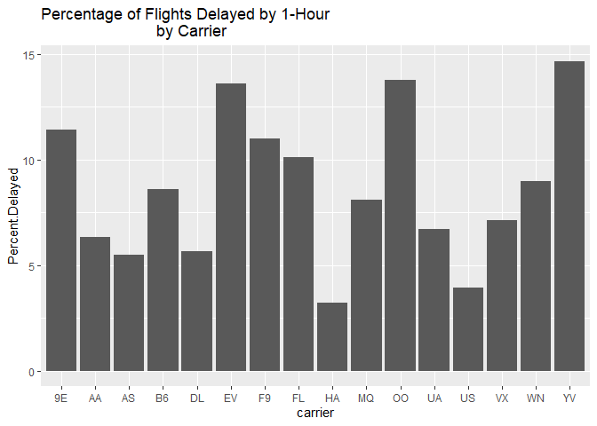
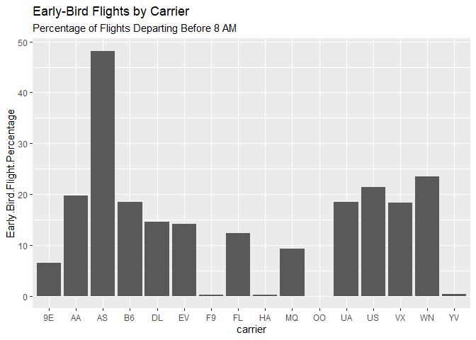

Homework 8
================

Firstly, we need to load the libraries required for this assignment. All
steps will require the ‘tidyverse’ library while the last step will
require ‘nycflights13’.

-----

``` r
library(tidyverse)
```

    ## Warning in as.POSIXlt.POSIXct(Sys.time()): unable to identify current timezone 'H':
    ## please set environment variable 'TZ'

    ## -- Attaching packages ----- tidyverse 1.3.0 --

    ## v ggplot2 3.3.2     v purrr   0.3.4
    ## v tibble  3.0.3     v dplyr   1.0.2
    ## v tidyr   1.1.2     v stringr 1.4.0
    ## v readr   1.3.1     v forcats 0.5.0

    ## -- Conflicts -------- tidyverse_conflicts() --
    ## x dplyr::filter() masks stats::filter()
    ## x dplyr::lag()    masks stats::lag()

``` r
library(nycflights13)
```

Homework Step 1. Generate a list containing three named objects. The
code to do this is listed below, with the objects ‘Frank’, ‘Pizza’, and
‘23’, each named ‘Name’, ‘Favorite Food’, and ‘Age’ respectively.

``` r
hw_08_list <- list( Name = "Frank", 
                    Favorite_Food = "Pizza", 
                    Age = 23)
glimpse(hw_08_list)
```

    ## List of 3
    ##  $ Name         : chr "Frank"
    ##  $ Favorite_Food: chr "Pizza"
    ##  $ Age          : num 23

The next goal is to call each of the elements in this list by different
calling mechanisms. As you can see, we call the first item on the list
by it’s name, then by \[\[ \]\] and \[\] syntax respectively for the
last two items on the list.

``` r
hw_08_list["Name"]
```

    ## $Name
    ## [1] "Frank"

``` r
hw_08_list[[2]]
```

    ## [1] "Pizza"

``` r
hw_08_list[3]
```

    ## $Age
    ## [1] 23

For the next step, we need to view the library ‘mtcars’ ‘s ’mpg’ column
in two different ways. The first method we have is simply calling mpg
using the single bracket format. \`

``` r
mtcars["mpg"]
```

    ##                      mpg
    ## Mazda RX4           21.0
    ## Mazda RX4 Wag       21.0
    ## Datsun 710          22.8
    ## Hornet 4 Drive      21.4
    ## Hornet Sportabout   18.7
    ## Valiant             18.1
    ## Duster 360          14.3
    ## Merc 240D           24.4
    ## Merc 230            22.8
    ## Merc 280            19.2
    ## Merc 280C           17.8
    ## Merc 450SE          16.4
    ## Merc 450SL          17.3
    ## Merc 450SLC         15.2
    ## Cadillac Fleetwood  10.4
    ## Lincoln Continental 10.4
    ## Chrysler Imperial   14.7
    ## Fiat 128            32.4
    ## Honda Civic         30.4
    ## Toyota Corolla      33.9
    ## Toyota Corona       21.5
    ## Dodge Challenger    15.5
    ## AMC Javelin         15.2
    ## Camaro Z28          13.3
    ## Pontiac Firebird    19.2
    ## Fiat X1-9           27.3
    ## Porsche 914-2       26.0
    ## Lotus Europa        30.4
    ## Ford Pantera L      15.8
    ## Ferrari Dino        19.7
    ## Maserati Bora       15.0
    ## Volvo 142E          21.4

We can also call ‘mtcars’ ‘s ’mpg’ column by calling the column number.
In this case, we call column 1 of mtcars.

``` r
mtcars[1]
```

    ##                      mpg
    ## Mazda RX4           21.0
    ## Mazda RX4 Wag       21.0
    ## Datsun 710          22.8
    ## Hornet 4 Drive      21.4
    ## Hornet Sportabout   18.7
    ## Valiant             18.1
    ## Duster 360          14.3
    ## Merc 240D           24.4
    ## Merc 230            22.8
    ## Merc 280            19.2
    ## Merc 280C           17.8
    ## Merc 450SE          16.4
    ## Merc 450SL          17.3
    ## Merc 450SLC         15.2
    ## Cadillac Fleetwood  10.4
    ## Lincoln Continental 10.4
    ## Chrysler Imperial   14.7
    ## Fiat 128            32.4
    ## Honda Civic         30.4
    ## Toyota Corolla      33.9
    ## Toyota Corona       21.5
    ## Dodge Challenger    15.5
    ## AMC Javelin         15.2
    ## Camaro Z28          13.3
    ## Pontiac Firebird    19.2
    ## Fiat X1-9           27.3
    ## Porsche 914-2       26.0
    ## Lotus Europa        30.4
    ## Ford Pantera L      15.8
    ## Ferrari Dino        19.7
    ## Maserati Bora       15.0
    ## Volvo 142E          21.4

The next step is to introduce a column into the mtcars dataset for
“displacement per cylinder”. We can do that via the commands below,
where we tell R to add store ‘mtcars’ as a new dataframe called
‘mtcars.data’ and then add the column called
‘displacement.per.cylinder’ to it, which is the result of dividing the
“disp” column by the “cyl” column.

``` r
mtcars.data <- mtcars
mtcars.data["displacement.per.cylinder"] <- mtcars$disp / mtcars$cyl

print(mtcars.data)
```

    ##                      mpg cyl  disp  hp drat    wt  qsec vs am gear carb
    ## Mazda RX4           21.0   6 160.0 110 3.90 2.620 16.46  0  1    4    4
    ## Mazda RX4 Wag       21.0   6 160.0 110 3.90 2.875 17.02  0  1    4    4
    ## Datsun 710          22.8   4 108.0  93 3.85 2.320 18.61  1  1    4    1
    ## Hornet 4 Drive      21.4   6 258.0 110 3.08 3.215 19.44  1  0    3    1
    ## Hornet Sportabout   18.7   8 360.0 175 3.15 3.440 17.02  0  0    3    2
    ## Valiant             18.1   6 225.0 105 2.76 3.460 20.22  1  0    3    1
    ## Duster 360          14.3   8 360.0 245 3.21 3.570 15.84  0  0    3    4
    ## Merc 240D           24.4   4 146.7  62 3.69 3.190 20.00  1  0    4    2
    ## Merc 230            22.8   4 140.8  95 3.92 3.150 22.90  1  0    4    2
    ## Merc 280            19.2   6 167.6 123 3.92 3.440 18.30  1  0    4    4
    ## Merc 280C           17.8   6 167.6 123 3.92 3.440 18.90  1  0    4    4
    ## Merc 450SE          16.4   8 275.8 180 3.07 4.070 17.40  0  0    3    3
    ## Merc 450SL          17.3   8 275.8 180 3.07 3.730 17.60  0  0    3    3
    ## Merc 450SLC         15.2   8 275.8 180 3.07 3.780 18.00  0  0    3    3
    ## Cadillac Fleetwood  10.4   8 472.0 205 2.93 5.250 17.98  0  0    3    4
    ## Lincoln Continental 10.4   8 460.0 215 3.00 5.424 17.82  0  0    3    4
    ## Chrysler Imperial   14.7   8 440.0 230 3.23 5.345 17.42  0  0    3    4
    ## Fiat 128            32.4   4  78.7  66 4.08 2.200 19.47  1  1    4    1
    ## Honda Civic         30.4   4  75.7  52 4.93 1.615 18.52  1  1    4    2
    ## Toyota Corolla      33.9   4  71.1  65 4.22 1.835 19.90  1  1    4    1
    ## Toyota Corona       21.5   4 120.1  97 3.70 2.465 20.01  1  0    3    1
    ## Dodge Challenger    15.5   8 318.0 150 2.76 3.520 16.87  0  0    3    2
    ## AMC Javelin         15.2   8 304.0 150 3.15 3.435 17.30  0  0    3    2
    ## Camaro Z28          13.3   8 350.0 245 3.73 3.840 15.41  0  0    3    4
    ## Pontiac Firebird    19.2   8 400.0 175 3.08 3.845 17.05  0  0    3    2
    ## Fiat X1-9           27.3   4  79.0  66 4.08 1.935 18.90  1  1    4    1
    ## Porsche 914-2       26.0   4 120.3  91 4.43 2.140 16.70  0  1    5    2
    ## Lotus Europa        30.4   4  95.1 113 3.77 1.513 16.90  1  1    5    2
    ## Ford Pantera L      15.8   8 351.0 264 4.22 3.170 14.50  0  1    5    4
    ## Ferrari Dino        19.7   6 145.0 175 3.62 2.770 15.50  0  1    5    6
    ## Maserati Bora       15.0   8 301.0 335 3.54 3.570 14.60  0  1    5    8
    ## Volvo 142E          21.4   4 121.0 109 4.11 2.780 18.60  1  1    4    2
    ##                     displacement.per.cylinder
    ## Mazda RX4                            26.66667
    ## Mazda RX4 Wag                        26.66667
    ## Datsun 710                           27.00000
    ## Hornet 4 Drive                       43.00000
    ## Hornet Sportabout                    45.00000
    ## Valiant                              37.50000
    ## Duster 360                           45.00000
    ## Merc 240D                            36.67500
    ## Merc 230                             35.20000
    ## Merc 280                             27.93333
    ## Merc 280C                            27.93333
    ## Merc 450SE                           34.47500
    ## Merc 450SL                           34.47500
    ## Merc 450SLC                          34.47500
    ## Cadillac Fleetwood                   59.00000
    ## Lincoln Continental                  57.50000
    ## Chrysler Imperial                    55.00000
    ## Fiat 128                             19.67500
    ## Honda Civic                          18.92500
    ## Toyota Corolla                       17.77500
    ## Toyota Corona                        30.02500
    ## Dodge Challenger                     39.75000
    ## AMC Javelin                          38.00000
    ## Camaro Z28                           43.75000
    ## Pontiac Firebird                     50.00000
    ## Fiat X1-9                            19.75000
    ## Porsche 914-2                        30.07500
    ## Lotus Europa                         23.77500
    ## Ford Pantera L                       43.87500
    ## Ferrari Dino                         24.16667
    ## Maserati Bora                        37.62500
    ## Volvo 142E                           30.25000

By printing the dataframe, we notice that the
‘displacement.per.cylinder’ column is present and we see that the
values are present.

We can also address this issue using “tidyverse”. Below, we tell R to,
once again, store mtcars into our data. This time, we create a new
dataframe, termed ‘tidyverse\_disp\_per\_cyl’, that is mutated by the
addition of a column that has the values of displacement divided by the
number of cylinders added to it. We then tell this new object to only
store the selected column and remove the rest of the mtcars data.

``` r
mtcars <- mtcars
tidyverse_disp_per_cyl <- mtcars %>%
  mutate(disp_per_cyl = (paste(disp / cyl))) %>%
  select(disp_per_cyl)
  
print(tidyverse_disp_per_cyl)
```

    ##        disp_per_cyl
    ## 1  26.6666666666667
    ## 2  26.6666666666667
    ## 3                27
    ## 4                43
    ## 5                45
    ## 6              37.5
    ## 7                45
    ## 8            36.675
    ## 9              35.2
    ## 10 27.9333333333333
    ## 11 27.9333333333333
    ## 12           34.475
    ## 13           34.475
    ## 14           34.475
    ## 15               59
    ## 16             57.5
    ## 17               55
    ## 18           19.675
    ## 19           18.925
    ## 20           17.775
    ## 21           30.025
    ## 22            39.75
    ## 23               38
    ## 24            43.75
    ## 25               50
    ## 26            19.75
    ## 27           30.075
    ## 28           23.775
    ## 29           43.875
    ## 30 24.1666666666667
    ## 31           37.625
    ## 32            30.25

Via this method, we store the actual value into this dataframe. However,
this dataframe has been stored as a character class. The significance
can be seen through the removal of “0” characters. As these were
non-meaningful, when storing the data as a character object, it removed
those characters.

Homework 8.2: Factors

``` r
num.vec <- c(3,4,1,5)

num.fac <- as.factor(num.vec)

num.vec.v2 <- as.numeric(num.fac)
```

With the command “num.vec \<- c(3,4,1,5)”, you can see the output,
listed below, shows the vector stored is a series of numbers “3 4 1 5”.

``` r
glimpse(num.vec)
```

    ##  num [1:4] 3 4 1 5

Now we convert this vector to a factor using the command “num.fac \<-
as.factor(num.vec)”. The output we receive is listed below.

``` r
glimpse(num.fac)
```

    ##  Factor w/ 4 levels "1","3","4","5": 2 3 1 4

You can see now that the values returned consist of the characters “1”,
“3”, “4”, and “5”. The order these are listed in is 2, 3, 1, 4, so
while “1” is the first character returned here, it is actually the third
number in the list. The first number in the list is the second returned
value, so “3”, followed by the third value, “4”, then “1” and “5”. So 2,
3, 1, 4 designates the list’s order, while 1, 3, 4, 5, are the
“alphabetical” character order of those returned values.

Lastly, when we return the factor to a numeric vector format, the
content is altered drastically. You can see this through the command
below.

``` r
glimpse(num.vec.v2)
```

    ##  num [1:4] 2 3 1 4

As you can see, instead of taking the original content, it has taken the
“alphabetical” order of those numbers instead, and returned them in this
vector conversion. All information regarding the original numbers is
lost, we now only know that the third number was the smallest, followed
by the first, second, and fourth.

Homework 8.3: Exploratory Data Analysis

This assignment requests for the exploration of data. In this case, the
‘nycflights13’ dataset was chosen for analysis.

8.3.1: Delayed Flights The first analysis that was conducted to
determine the percentage of flights from each carrier that were at least
one hour later. First, like mentioned before, the libraries required for
this part of the homework are ‘tidyverse’ and ‘nycflights13’

``` r
library(tidyverse)
library(nycflights13)
```

The next command sent is to create a new dataframe, called
‘carrier\_delays’ that is derived from the ‘nycflights13:flights’ data
set. This data will then be grouped by whether theflights were at least
60 minutes late and by carrier. The results of the grouping will be
summarised in a column titled ‘delayed.flight.per.carrier’.

``` r
carrier_delays <- flights %>%
  group_by(dep_delay >= 60, carrier) %>%
  summarise(delayed.flights.per.carrier = n(), .groups='keep')

print(carrier_delays)
```

    ## # A tibble: 47 x 3
    ## # Groups:   dep_delay >= 60, carrier [47]
    ##    `dep_delay >= 60` carrier delayed.flights.per.carrier
    ##    <lgl>             <chr>                         <int>
    ##  1 FALSE             9E                            15425
    ##  2 FALSE             AA                            30059
    ##  3 FALSE             AS                              673
    ##  4 FALSE             B6                            49514
    ##  5 FALSE             DL                            45062
    ##  6 FALSE             EV                            44372
    ##  7 FALSE             F9                              607
    ##  8 FALSE             FL                             2864
    ##  9 FALSE             HA                              331
    ## 10 FALSE             MQ                            23126
    ## # ... with 37 more rows

Next, we need to divide the column containing the values for
‘delayed.flight.per.carrier’ into their own unique columns based on
the various row values (e.g. ‘FALSE, ’TRUE’, ‘NA’). To do this, we first
generate a new object, termed ‘wide\_carrier\_delays’, that is created
by having R pivot the data, taking column names from the ‘dep\_delay \>=
60’ column, and the values from the ‘delayed.flights.per.carrier column.
We also choose to rename this data to make it more clear what they are
testing. Column names are changed from ’FALSE’ and ‘TRUE’ to
‘Not.One.Hour.Late’ and ‘One.Hour.Late’, respectively.’NA’ was also
changed to ‘Unknown’, as the data for these flights are not listed. This
data will not be used in further analysis as it may skew results.

``` r
wide_carrier_delays <- carrier_delays %>% 
      pivot_wider(names_from = 'dep_delay >= 60', values_from = 
                'delayed.flights.per.carrier') %>%
      rename(Not.One.Hour.Late = 'FALSE', One.Hour.Late = 'TRUE', 
             Unknown = 'NA')

print(wide_carrier_delays)
```

    ## # A tibble: 16 x 4
    ## # Groups:   carrier [16]
    ##    carrier Not.One.Hour.Late One.Hour.Late Unknown
    ##    <chr>               <int>         <int>   <int>
    ##  1 9E                  15425          1991    1044
    ##  2 AA                  30059          2034     636
    ##  3 AS                    673            39       2
    ##  4 B6                  49514          4655     466
    ##  5 DL                  45062          2699     349
    ##  6 EV                  44372          6984    2817
    ##  7 F9                    607            75       3
    ##  8 FL                   2864           323      73
    ##  9 HA                    331            11      NA
    ## 10 MQ                  23126          2037    1234
    ## 11 OO                     25             4       3
    ## 12 UA                  54080          3899     686
    ## 13 US                  19094           779     663
    ## 14 VX                   4766           365      31
    ## 15 WN                  10999          1084     192
    ## 16 YV                    465            80      56

After entering this command, we can see that our data is now nicely
sorted by whether or not the flights were late, as well as by the flight
carriers. Now we need to add in some simple mathematics to determine the
percentage of flights that were late. This is done by generating a new
object, termed ‘wide\_carrier\_delays\_percentage’ derived from the
‘wide\_carrier\_delays’ dataset previously created. This new dataset
is generated by the addition of two new columns. Firstly, we generated
one column listing the values of flights that were and were not one hour
late, by summing the columns ‘Not.One.Hour.Late’ and ‘One.Hour.Late’,
returned as ‘Total.Flights’. We then add a second column which will give
us the percentage of late flights. This column, termed ‘Percent.delayed’
is created by dividing the ‘One.Hour.Late’ flights by ‘Total.Flights’
and multiplying the value by 100. This returns a percentage of flights
that were late, by carrier.

``` r
wide_carrier_delays_percentage <- wide_carrier_delays %>%
  mutate(Total.Flights = Not.One.Hour.Late + One.Hour.Late) %>%
  mutate(Percent.Delayed = (One.Hour.Late / Total.Flights)*100)

print(wide_carrier_delays_percentage)
```

    ## # A tibble: 16 x 6
    ## # Groups:   carrier [16]
    ##    carrier Not.One.Hour.Late One.Hour.Late Unknown Total.Flights Percent.Delayed
    ##    <chr>               <int>         <int>   <int>         <int>           <dbl>
    ##  1 9E                  15425          1991    1044         17416           11.4 
    ##  2 AA                  30059          2034     636         32093            6.34
    ##  3 AS                    673            39       2           712            5.48
    ##  4 B6                  49514          4655     466         54169            8.59
    ##  5 DL                  45062          2699     349         47761            5.65
    ##  6 EV                  44372          6984    2817         51356           13.6 
    ##  7 F9                    607            75       3           682           11.0 
    ##  8 FL                   2864           323      73          3187           10.1 
    ##  9 HA                    331            11      NA           342            3.22
    ## 10 MQ                  23126          2037    1234         25163            8.10
    ## 11 OO                     25             4       3            29           13.8 
    ## 12 UA                  54080          3899     686         57979            6.72
    ## 13 US                  19094           779     663         19873            3.92
    ## 14 VX                   4766           365      31          5131            7.11
    ## 15 WN                  10999          1084     192         12083            8.97
    ## 16 YV                    465            80      56           545           14.7

Lastly, we can graph the data by generating a bar plot that consists of
the individual carriers on the x-axis and the percent of delayed flights
on the y-axis. We can also give our graph a title “Percentage of Flights
Delayed by 1-Hour by Carrier”.

``` r
Percent_delayed_plot <- ggplot(wide_carrier_delays_percentage, 
                               aes(x = carrier, y =  Percent.Delayed))+
                  ggtitle(label= "Percentage of Flights Delayed by 1-Hour
                          by Carrier")+
                  geom_bar(stat = "identity")

print(Percent_delayed_plot)
```

<!-- -->

The full length of code for the above commands is listed below.

``` r
library(tidyverse)
library(nycflights13)

carrier_delays <- flights %>%
  group_by(dep_delay >= 60, carrier) %>%
  summarise(delayed.flights.per.carrier = n(), .groups='keep')


wide_carrier_delays <- carrier_delays %>% 
      pivot_wider(names_from = 'dep_delay >= 60', values_from = 
                'delayed.flights.per.carrier') %>%
      rename(Not.One.Hour.Late = 'FALSE', One.Hour.Late = 'TRUE', 
             Unknown = 'NA')

wide_carrier_delays_percentage <- wide_carrier_delays %>%
  mutate(Total.Flights = Not.One.Hour.Late + One.Hour.Late) %>%
  mutate(Percent.Delayed = (One.Hour.Late / Total.Flights)*100)

Percent_delayed_plot <- ggplot(wide_carrier_delays_percentage, 
                               aes(x = carrier, y =  Percent.Delayed))+
                  ggtitle(label= "Percentage of Flights Delayed by 1-Hour
                          by Carrier")+
                  geom_bar(stat = "identity")
```

8.3.2: Early-Bird Flights

The next data analysis conducted was performed to identify if different
carriers showed varying biases towards early day flights, specifically
before 8 AM.

The first step is to once again load the required libraries.

``` r
library(tidyverse)
library(nycflights13)
```

Next, we generate a dataframe labeled ‘early\_bird\_flights’ from the
‘nycflights13::flights’ data. The data taken is immediately grouped by
scheduled departure time, ‘dep\_time’, being less than 801, or 8:01 AM,
as well as by ‘carrier’. Data acquired is kept in a new column termed,
‘early.bird.flights.per.carrier’.

``` r
early_bird_flights <- flights %>%
  group_by(dep_time < 801, carrier) %>%
  summarise(early.bird.flights.per.carrier = n(), .groups='keep')

print(early_bird_flights)
```

    ## # A tibble: 46 x 3
    ## # Groups:   dep_time < 801, carrier [46]
    ##    `dep_time < 801` carrier early.bird.flights.per.carrier
    ##    <lgl>            <chr>                            <int>
    ##  1 FALSE            9E                               16282
    ##  2 FALSE            AA                               25779
    ##  3 FALSE            AS                                 369
    ##  4 FALSE            B6                               44187
    ##  5 FALSE            DL                               40806
    ##  6 FALSE            EV                               44083
    ##  7 FALSE            F9                                 680
    ##  8 FALSE            FL                                2795
    ##  9 FALSE            HA                                 341
    ## 10 FALSE            MQ                               22835
    ## # ... with 36 more rows

After establishing this dataset, like previously done, we will need to
pivot the data on the desired column. We therefore take the column
‘dep\_time \< 801’, and pivot the data on it, generating columns with
names from the values in column ‘dep\_time \< 801’ and values from the
integers in column ‘early.bird.flights.per.carrier’. Once again, we
rename the columns listed to match the description as performed in the
first data analysis, rather than using ‘FALSE’, ‘TRUE’, and ‘NA’.

``` r
wide_early_bird_flights <- early_bird_flights %>% 
      pivot_wider(names_from = 'dep_time < 801', values_from = 
                'early.bird.flights.per.carrier') %>%
      rename(Regular.Flight = 'FALSE', Early.Bird.Flight = 'TRUE', 
             Unknown = 'NA')

print(wide_early_bird_flights)
```

    ## # A tibble: 16 x 4
    ## # Groups:   carrier [16]
    ##    carrier Regular.Flight Early.Bird.Flight Unknown
    ##    <chr>            <int>             <int>   <int>
    ##  1 9E               16282              1134    1044
    ##  2 AA               25779              6314     636
    ##  3 AS                 369               343       2
    ##  4 B6               44187              9982     466
    ##  5 DL               40806              6955     349
    ##  6 EV               44083              7273    2817
    ##  7 F9                 680                 2       3
    ##  8 FL                2795               392      73
    ##  9 HA                 341                 1      NA
    ## 10 MQ               22835              2328    1234
    ## 11 OO                  29                NA       3
    ## 12 UA               47289             10690     686
    ## 13 US               15631              4242     663
    ## 14 VX                4188               943      31
    ## 15 WN                9246              2837     192
    ## 16 YV                 543                 2      56

After this, we once again need to add in columns that list the total
flights considered and the percentage of flights classified as “early
bird flights”, or before 8 AM. This is first done by adding the columns
‘Regular.Flight’ and ‘Early.Bird.Flight’, giving us the column and
values for ‘Total.Flights’. Next, we take the ‘Early.Bird.Flight’ and
divide it by ‘Total.Flights’, then multiplying it by 100. This gives us
the percentage by carrier of flights that were before 8 AM.

``` r
early_bird_flight_percentage <- wide_early_bird_flights %>%
  mutate(Total.Flights = Early.Bird.Flight + Regular.Flight) %>%
  mutate(Early.Bird.Flight.Percentage = (Early.Bird.Flight / Total.Flights)*100)

print(early_bird_flight_percentage)
```

    ## # A tibble: 16 x 6
    ## # Groups:   carrier [16]
    ##    carrier Regular.Flight Early.Bird.Flig~ Unknown Total.Flights
    ##    <chr>            <int>            <int>   <int>         <int>
    ##  1 9E               16282             1134    1044         17416
    ##  2 AA               25779             6314     636         32093
    ##  3 AS                 369              343       2           712
    ##  4 B6               44187             9982     466         54169
    ##  5 DL               40806             6955     349         47761
    ##  6 EV               44083             7273    2817         51356
    ##  7 F9                 680                2       3           682
    ##  8 FL                2795              392      73          3187
    ##  9 HA                 341                1      NA           342
    ## 10 MQ               22835             2328    1234         25163
    ## 11 OO                  29               NA       3            NA
    ## 12 UA               47289            10690     686         57979
    ## 13 US               15631             4242     663         19873
    ## 14 VX                4188              943      31          5131
    ## 15 WN                9246             2837     192         12083
    ## 16 YV                 543                2      56           545
    ## # ... with 1 more variable: Early.Bird.Flight.Percentage <dbl>

Lastly, we can once again graph our data by carrier and percentage of
flights before 8 AM. This is done via the commands below.

``` r
early_bird_plot <- ggplot(early_bird_flight_percentage, 
                               aes(x = carrier, y =  Early.Bird.Flight.Percentage))+
                  ggtitle(label= "Early-Bird Flights by Carrier",
                          subtitle= "Percentage of Flights Departing Before 8 AM")+
                  geom_bar(stat = "identity")

print(early_bird_plot)
```

    ## Warning: Removed 1 rows containing missing values (position_stack).

<!-- --> As you can
see, the percentage of flights that take off before 8 AM varied
drastically by carrier.

The entire code for this set of data is listed below.

``` r
library(tidyverse)
library(nycflights13)

early_bird_flights <- flights %>%
  group_by(dep_time < 801, carrier) %>%
  summarise(early.bird.flights.per.carrier = n(), .groups='keep')


wide_early_bird_flights <- early_bird_flights %>% 
      pivot_wider(names_from = 'dep_time < 801', values_from = 
                'early.bird.flights.per.carrier') %>%
      rename(Regular.Flight = 'FALSE', Early.Bird.Flight = 'TRUE', 
             Unknown = 'NA')

early_bird_flight_percentage <- wide_early_bird_flights %>%
  mutate(Total.Flights = Early.Bird.Flight + Regular.Flight) %>%
  mutate(Early.Bird.Flight.Percentage = (Early.Bird.Flight / Total.Flights)*100)

early_bird_plot <- ggplot(early_bird_flight_percentage, 
                               aes(x = carrier, y =  Early.Bird.Flight.Percentage))+
                  ggtitle(label= "Early-Bird Flights by Carrier",
                          subtitle= "Percentage of Flights Departing Before 8 AM")+
                  geom_bar(stat = "identity")
```
