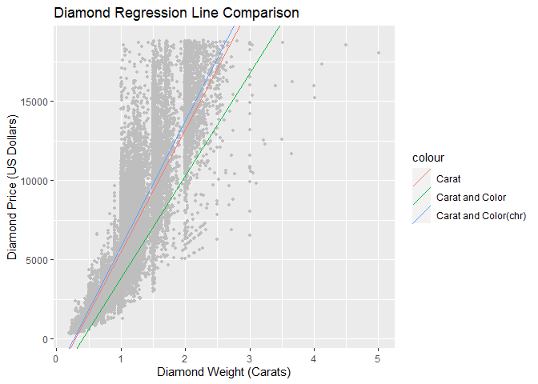

Homework 10
================

Linear Models

As always, our very first step is to load the libraries we will be
using. In this instance, we will only be using ‘tidyverse’.

``` r
library(tidyverse)
```

    ## Warning in as.POSIXlt.POSIXct(Sys.time()): unable to identify current timezone 'H':
    ## please set environment variable 'TZ'

    ## -- Attaching packages ------------------------------------------ tidyverse 1.3.0 --

    ## v ggplot2 3.3.2     v purrr   0.3.4
    ## v tibble  3.0.3     v dplyr   1.0.2
    ## v tidyr   1.1.2     v stringr 1.4.0
    ## v readr   1.3.1     v forcats 0.5.0

    ## -- Conflicts --------------------------------------------- tidyverse_conflicts() --
    ## x dplyr::filter() masks stats::filter()
    ## x dplyr::lag()    masks stats::lag()

After loading our libraries, we can start by answering the first
question. This problem asks us to create a linear model of price as a
function of the carat of a diamond from the ‘diamonds’ dataset. This can
be done using the command below.

``` r
diamonds_data <- diamonds

carat_price <- lm(price ~ carat, data = diamonds_data)
```

First we stored the diamonds dataset as our own object, then we stored a
new object that is the linear model \[lm()\] of price as a function of
carat values from the diamonds\_data object.

From this value we, will want the “Intercept” and “carat” values. In a
normal formula, these are the “b” and “m” values in y = mx + b. We can
store these values below as their own value set.

``` r
carat_price_coefficients <- carat_price$coefficients
print(carat_price_coefficients)
```

    ## (Intercept)       carat 
    ##   -2256.361    7756.426

We can now solve for y which is our “price” value, given that a single
carat is used. So “price” = mx + b, or “price” = 7756.426(carat) +
-2256.361. The formula below calculates this for us.

``` r
carat_cost_equation <- function(x,y) {
  (x - (y [1]))/(y [2])
}

carat_value <- 1

carat_cost_equation(carat_value, carat_price_coefficients)
```

    ## (Intercept) 
    ##    0.291031

This value of $0.29 is how much a diamond should cost based solely on
the carat. Obviously more goes into this calculation than just the
weight, as 30 cents for a diamond is ridiculously low. Using other
methods we can look at the role of other values along with carats on
diamond price.

We can take into account two variables using the code below, color and
carat, opposed to just the carat.

``` r
carat_and_color_price <- lm(price ~ carat + color, data = diamonds_data)
```

After this, we can store the coefficients we desire once again.

``` r
carat_and_color_price_coefficients <- carat_and_color_price$coefficients
print(carat_and_color_price_coefficients)
```

    ## (Intercept)       carat     color.L     color.Q     color.C     color^4 
    ## -2702.23261  8066.62302 -1572.19930  -741.14453  -122.69603    78.76541 
    ##     color^5     color^6 
    ##  -144.74008  -180.74716

We now see that several values come into play now. However, we once
again will be using the first two and one other value, dependent on the
color being utilized. We can calculate the value of a single carat and
color L using the formula below.

``` r
carat_color_cost_equation <- function(x,y) {
  (x - (y [1]))/(y [2] + y[3])
}

carat_color_cost_equation(carat_value, carat_and_color_price_coefficients)
```

    ## (Intercept) 
    ##    0.416239

So, the value of a diamond per carat is $0.42. This obviously off, but
it is the value address by the linear model. If you notice previously,
the coefficient values listed were not the actual colors listed in
diamonds. This can be seen below.

``` r
print(summary(diamonds_data$color))
```

    ##     D     E     F     G     H     I     J 
    ##  6775  9797  9542 11292  8304  5422  2808

As you can see here, the colors are labeled D through J, not L, Q, C or
any other color listed in the previous coefficients. This is due to the
data being an “ordered” class opposed to a “character” class. We can
store the colors as character data via the code below.

``` r
carat_and_chr_color_price <- lm(price ~ carat + as.character(color), diamonds_data)
```

We once again store the coefficients as their own values.

``` r
carat_and_chr_color_price_coefficients <- carat_and_chr_color_price$coefficients
print(carat_and_chr_color_price_coefficients)
```

    ##          (Intercept)                carat as.character(color)E 
    ##          -2136.22885           8066.62302            -93.78129 
    ## as.character(color)F as.character(color)G as.character(color)H 
    ##            -80.26286            -85.53628           -732.24183 
    ## as.character(color)I as.character(color)J 
    ##          -1055.73186          -1914.47220

We now see the color values are listed appropriately as opposed to
before and that the listed color values are much different than before.
They also appear to be more well ordered, especially as D is the highest
grade of color, then E, F, G, etc. The number decreasing in value makes
sense here in that regard, whereas before there was no obvious pattern
regarding the color values.

If we use the carat\_color\_cost\_equation from before, we can also see
the prioe values have changed.

``` r
carat_color_cost_equation(carat_value, carat_and_chr_color_price_coefficients)
```

    ## (Intercept) 
    ##   0.2680636

We can see this value is much closer to the original value, compared to
when the data was in an ordered format. Now we can plot all of the lines
with the data below to determine which line fits the data best.

``` r
regression_comparison <- ggplot(diamonds_data, aes(carat, price)) +
  geom_point(size = 1, colour = 'grey') +
  geom_abline(
    aes(intercept = carat_price$coefficients[1], 
        slope = carat_price$coefficients[2],
        colour = "Carat")) +
  geom_abline(
    aes(intercept = carat_and_color_price$coefficients[1], 
        slope = (carat_and_color_price$coefficients[2] + 
                   carat_and_color_price$coefficients[3]),
        colour = "Carat and Color")) +
  geom_abline(
    aes(intercept = carat_and_chr_color_price$coefficients[1], 
    slope = (carat_and_chr_color_price$coefficients[2] + 
             carat_and_chr_color_price$coefficients[3]),
    colour = "Carat and Color(chr)"))+
  ggtitle(label = "Diamond Regression Line Comparison") +
  xlab("Diamond Weight (Carats)") +
  ylab("Diamond Price (US Dollars)")
  
print(regression_comparison)
```

<!-- --> By viewing
these trends, we can see that the “Carat” and “Carat and Color” models
fit the data the best. Distinguishing which of these is actually the
line of best fit would be difficult, but as they are so similar either
should be fine in this case.

Objects

Currently, we already have our required libraries stored from earlier,
so no need to enter anymore library commands here. The first step thing
we want to do is to generate a new class. Firstly, we’ll introduce a
scenario. Say we have an individual who works at a veterinarian’s office
and is storing new clients pet information. We can first load the data
below into our chart.

``` r
animal_information <- as.data.frame(read.csv("data/Pet_Info.csv"))
print(animal_information)
```

    ##   Pet.Name Pet.Age Pet.Sex Pet.Species          Pet.Breed Rabies.Shot
    ## 1      Max    "13"    Male         Dog   Golden Retriever         Yes
    ## 2   Phoebe    "18"  Female         Cat      Tortoiseshell         Yes
    ## 3    Sally    "14"  Female         Cat             Calico         Yes
    ## 4     Auri     "2"  Female         Cat             Calico         Yes
    ## 5   Shelly    "14"  Female         Cat             Calico         Yes
    ## 6   Maddie    "10"  Female         Dog Labrador Retriever         Yes
    ##   All.other.shots
    ## 1             Yes
    ## 2             Yes
    ## 3              No
    ## 4              No
    ## 5             Yes
    ## 6             Yes

As you can see, we have a variety of different pets. In this case, if
several file formats have similar structures, it may be useful to
generate a new class to distinguish this data type for others.

``` r
class_creation <- function(df, user) {
  if (! class(df) == "data.frame") {
    warning("Error: Data provided is not in a data.frame format.")
  }
  else if (! class(user) == "character"){
    warning("Error: User provided is not given as a character value.")
  }
  else { attr(df, "user") <- user
  structure(df, class = c("pet_description", "data.frame"))
  }
}
```

In the command above we do just that, shifting this “data.frame” class
to a new structured class termed “pet\_description”. Note that the code
specifically ensures the original file format (df) is a “data.frame” and
that the user is a character string. Otherwise warning messages will be
returned. Assuming those conditions are met, the final query informs the
function to create a new class called “pet\_description” with the same
structure as a “data.frame”.

Next, we can verify this data works using the code below.

``` r
new_class <- class_creation(animal_information, user = "John Smith")
```

This command does several things. First is calls the function
“class\_creation” that we just generated, and tells it to look at the
“animal\_information” data frame. Next, it tells the class to store a
user, in this case “John Smith”. When we observe the class of this
“new\_class” object, we see that it has been altered from the original
data.frame class.

``` r
class(new_class)
```

    ## [1] "pet_description" "data.frame"

As we can see, the title for this class is “pet\_description” but it
mimics the formatting of a data.frame class. Now we can focus on
utilizing a bit more of the information entered before by designing a
summary command. If you remember before the attribute (attr) added to
the initial class design function included a “user” variable. In this
case, the user can just be referred to as the one entering the new
veterinarian client information.

``` r
new_summary.pet_description <- function(df) {
  print(paste0("Data Filed by: ", attr(df, "user")))
  df_summ <- summary.data.frame(df)
  df_summ
}
```

By entering the “summary.pet\_description” command below, we now can
relay the data as well as an initial statement of who entered the data.

``` r
new_summary.pet_description(new_class)
```

    ## [1] "Data Filed by: John Smith"

    ##    Pet.Name           Pet.Age            Pet.Sex          Pet.Species       
    ##  Length:6           Length:6           Length:6           Length:6          
    ##  Class :character   Class :character   Class :character   Class :character  
    ##  Mode  :character   Mode  :character   Mode  :character   Mode  :character  
    ##   Pet.Breed         Rabies.Shot        All.other.shots   
    ##  Length:6           Length:6           Length:6          
    ##  Class :character   Class :character   Class :character  
    ##  Mode  :character   Mode  :character   Mode  :character

Items like this can prove useful in clarifying pertinent information
about a dataset, in this case who entered the data. Perhaps this would
allow for easy troubleshooting, telling anyone to talk to John Smith and
if any inconsistencies are found in the information he filed.
